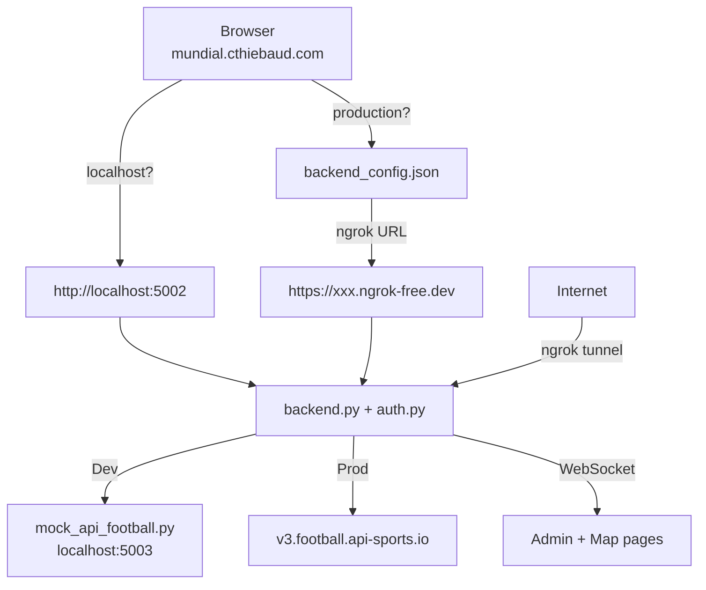

# mundial-server

Backend for the [Born In, Plays For](https://github.com/born-in-plays-for) project: API-Football proxy, Google Sign-In authentication, admin dashboard with live WebSocket updates, per-device session tracking, and force-kick.

## Setup

```bash
pip install flask flask-socketio requests
```

### Environment variables

| Variable | Required | Description |
|---|---|---|
| `API_FOOTBALL_KEY` | yes | API-Football key, or `mock` for development |
| `API_FOOTBALL_URL` | no | Override API base URL (default: `https://v3.football.api-sports.io`) |
| `FLASK_SECRET` | no | Fixed session signing key. If unset, a key is auto-generated and saved to `.flask_secret` on first run — sessions survive restarts either way |

## Files

| File | Purpose |
|---|---|
| `backend.py` | Flask backend — API-Football proxy, WebSocket, serves admin pages |
| `auth.py` | Reusable Google Sign-In + session management module — see [AUTH.md](AUTH.md) |
| `mock_api_football.py` | Mock API-Football server for development (no API calls) |
| `admin.html` | Admin page — discover/auto-track controls, per-fixture tracking toggles (`/admin`) |
| `admin_auth.html` | Auth admin page — registered users, active sessions, kick/delete (`/admin-auth`) — see [AUTH.md](AUTH.md) |
| `login.html` | Standalone Google Sign-In page (also used as popup from the map page) |
| `start.sh` | One-command startup: kills any stale process on port 5002, starts backend + ngrok, extracts the public URL from ngrok's JSON log, auto-publishes URL to GitHub Pages |
| `users.json` | Persisted user history (gitignored) |
| `polls/` | Saved poll snapshots — one JSON per tick (gitignored) |
| `.flask_secret` | Auto-generated session signing key (gitignored) |
| `client_secret_*.json` | Google OAuth secret (gitignored) |

## Quick start

### Local development (auth-only, no API-Football)

```bash
API_FOOTBALL_KEY=mock python3 backend.py
```

### Local development (with mock API-Football)

```bash
# Terminal 1 — mock API-Football on port 5003
python3 mock_api_football.py

# Terminal 2 — backend on port 5002, pointing at mock
API_FOOTBALL_KEY=mock API_FOOTBALL_URL=http://localhost:5003 python3 backend.py
```

### Production (real API-Football + ngrok)

```bash
./start.sh
```

`start.sh` does everything in one command:
1. Kills any stale process on port 5002
2. Starts `backend.py`
3. Starts `ngrok http 5002` and extracts the public URL from its JSON log output
4. Updates `backend_config.json` in the `mundial` repo and pushes to GitHub Pages

API key: https://dashboard.api-football.com/register — free tier gives 100 requests/day; paid plan gives 7500/day.
Dashboard (usage stats, key): https://dashboard.api-football.com/

## URLs

### Local testing

| URL | What |
|---|---|
| `http://localhost:5002/login` | Login page |
| `http://localhost:5002/admin` | Admin — fixtures / discover / track |
| `http://localhost:5002/admin-auth` | Admin — users / sessions / kick |
| `http://localhost:4040/wc2026_live_game.html` | Live game page (nginx) |

### Production (ngrok running)

| URL | What |
|---|---|
| `https://mundial.cthiebaud.com/wc2026_live_game.html` | Live game page — reads ngrok URL from `backend_config.json` |
| `https://xxx.ngrok-free.dev/login` | Login page |
| `https://xxx.ngrok-free.dev/admin` | Admin — fixtures / discover / track |
| `https://xxx.ngrok-free.dev/admin-auth` | Admin — users / sessions / kick |

## Endpoints

| Route | Method | Description |
|---|---|---|
**Auth endpoints** (`/login`, `/api/auth/*`, `/api/admin/users|online|kick|delete`) are registered by `auth.py` — see [AUTH.md](AUTH.md).

| Route | Method | Description |
|---|---|---|
| `/api/poll/active` | GET | Discovery state + tracked fixture IDs |
| `/api/live` | GET | Latest stored fixtures (no API call) |
| `/api/lineups/<id>` | GET | Starting XI + substitutes for a fixture (fetched on demand) |
| `/api/standings` | GET | Group standings (cached 5 min) |
| `/api/group-results` | GET | Finished group stage fixtures (cached 5 min) |
| `/admin` | GET | Fixtures admin page (discover / track) |
| `/admin-auth` | GET | Auth admin page (users / sessions / kick) — see [AUTH.md](AUTH.md) |
| `/api/admin/poll/start` | POST | Start discovery loop (admin only) |
| `/api/admin/poll/stop` | POST | Stop discovery loop (admin only) |
| `/api/admin/poll/discover` | POST | Re-run fixture discovery immediately (admin only) |
| `/api/admin/poll/status` | GET | Discovery/tracking state, per-fixture info, saved poll count (admin only) |
| `/api/admin/poll/wc-filter` | POST | Toggle World Cup–only fixture filter (admin only) |
| `/api/admin/polls` | GET | List saved poll filenames (admin only) |
| `/api/admin/polls/<name>` | GET | Get a specific saved poll by name (admin only) |
| `/api/admin/track/start` | POST | Arm auto-track (admin only) |
| `/api/admin/track/stop` | POST | Disarm auto-track (admin only) |
| `/api/admin/track/fixture` | POST | Toggle tracking for one fixture `{fid, tracked}` (admin only) |
| `/api/admin/track/all` | POST | Toggle tracking for all fixtures `{tracked}` (admin only) |

### WebSocket events

| Event | Direction | Payload |
|---|---|---|
| `live_update` | server → client | `[fixtures]` — every 60s when auto-track is on; each fixture has a `_tracked` bool flag |
| `poll_status` | server → client | `{discovering, fixtures, wc_only}` — when admin toggles discovery or fixture tracking. `tracking` (auto-track on/off) is intentionally absent — it is an internal automation detail, not client-facing |
| `user_login` | server → client | `{email, name, picture, last_login, device, sid}` |
| `user_logout` | server → client | `{email, name, picture, sid}` |
| `user_kicked` | server → client | `{email, sid?}` — if `sid` is present, only that session is kicked |
| `user_deleted` | server → client | `{email}` — user removed from `users.json` |

## Authentication

Handled by `auth.py` — see **[AUTH.md](AUTH.md)** for the full reference: sign-in flow, endpoints, WebSocket events, session persistence, Google Cloud Console setup, and cross-origin auth.

## API-Football: discovery and auto-tracking

The backend has two independent loops, each controlled separately by admin endpoints:

### Discovery (`/api/admin/poll/start` · `/api/admin/poll/stop`)

Every 120s, fetches all live fixtures from API-Football and filters to World Cup only (toggleable via WC filter). Populates `KNOWN_FIXTURES` and emits `poll_status` to all clients. Can also be triggered manually via `/api/admin/poll/discover`.

On startup, the latest saved poll is loaded from `polls/` so `/api/live` always has data immediately. Only fixtures with an active in-progress status (`1H`, `2H`, `ET`, `P`) are loaded — finished matches are discarded on restart.

### Auto-Track (`/api/admin/track/start` · `/api/admin/track/stop`)

An internal automation helper. When set, every 60s fetches fixture data, events, and statistics for each fixture in `KNOWN_FIXTURES` that has `tracked=True` (3 API calls per fixture per tick). Broadcasts `live_update` via WebSocket and saves each poll to `polls/` as a timestamped JSON file.

**This is transparent to clients.** Auto-track being on or off is never sent via WebSocket — clients observe it only indirectly through the `_tracked` flag on each fixture in `live_update`.

### Per-fixture tracking

Each fixture in `KNOWN_FIXTURES` has an individual `tracked` flag controlled via `/api/admin/track/fixture`. The fixture's `_tracked` flag is included in every `live_update` so clients can dim or hide untracked fixtures without knowing anything about the global auto-track state.

### State model

| Discovering? | Fixtures found? | Description |
|---|---|---|
| No | — | Server not polling API-Football at all — deaf and mute |
| Yes | No | Polling, nothing found yet — listening |
| Yes | Yes | Active — fixtures discovered and (optionally) being tracked |

On startup, the latest saved poll is loaded so `/api/live` always has data even before discovery starts.

## Architecture



### Backend URL discovery

The frontend auto-detects the backend:

- **`localhost` or `127.0.0.1`** → always uses `http://localhost:5002` (no config file needed)
- **Any other hostname** → reads `backend_config.json` from the repo root for the ngrok URL

This means `backend_config.json` only matters for production and never needs editing for local dev.

## Exposing to the internet (ngrok)

### One-time setup

```bash
brew install ngrok
ngrok config add-authtoken YOUR_TOKEN
```

### Port conflict with nginx

ngrok's web inspector defaults to port 4040. If that conflicts with another service, add `web_addr` to ngrok config (`~/Library/Application Support/ngrok/ngrok.yml`):

```yaml
version: "3"
agent:
    authtoken: YOUR_TOKEN
    web_addr: localhost:4041
```

Note: `start.sh` extracts the public URL from ngrok's JSON log output, not from the web inspector — so the inspector port doesn't matter for `./start.sh` to work.

**ngrok URL stability:** on the free plan, the URL is technically ephemeral but in practice tends to stay the same across restarts. If it ever changes, you'll need to:

1. Update `backend_config.json` with the new URL and push to GitHub
2. Add the new URL to Google OAuth authorized JavaScript origins

WebSockets work through ngrok — use `{transports: ['websocket']}` on the client to avoid CORS issues with polling fallback.

## See also

- [born-in-plays-for](https://github.com/born-in-plays-for) — org overview + architecture diagram
- [mundial](https://github.com/born-in-plays-for/mundial) — frontend
- [mundial-data](https://github.com/born-in-plays-for/mundial-data) — shared data files
- [mundial-build](https://github.com/born-in-plays-for/mundial-build) — data pipeline
